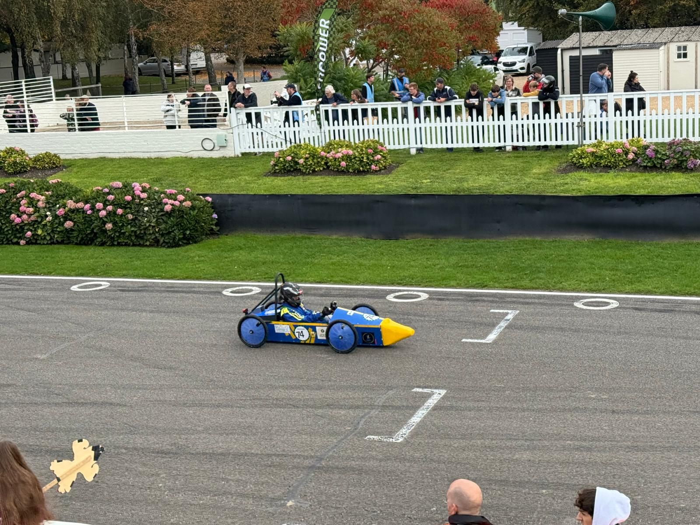
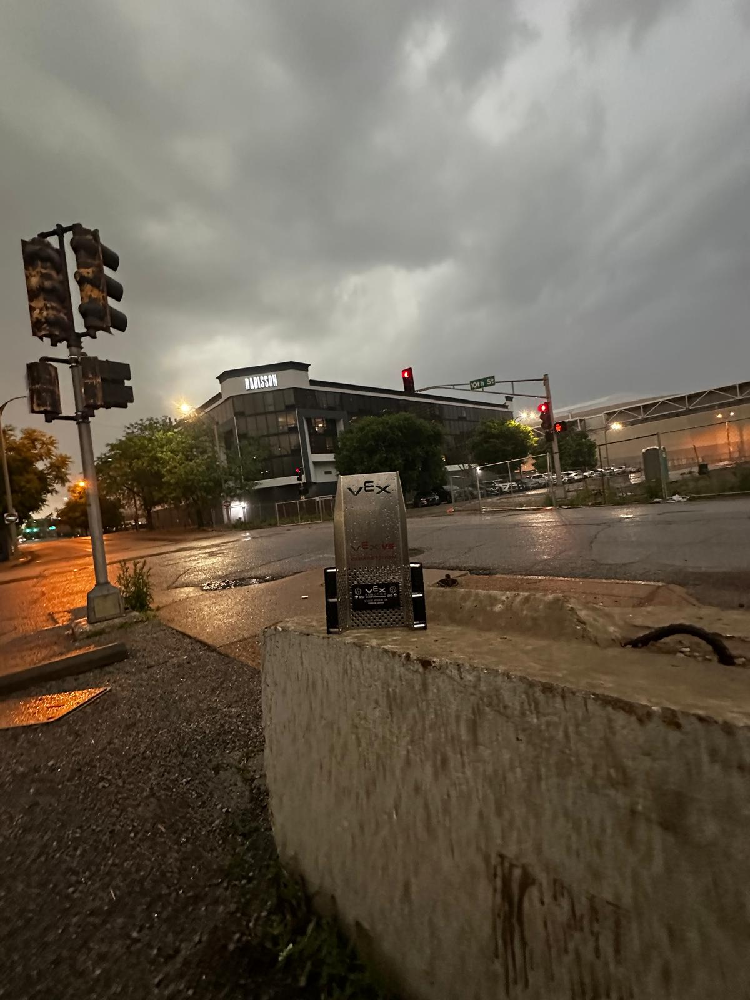

  📫 <a href="mailto:panshulvempalli@gmail.com">panshulvempalli@gmail.com</a>

###   🐍 Enjoy this quick animation

  

 

<table align="center">
<tr>
<td align="center">🤖 VEX V5 Robotics — Team <a href="https://habs-gliders-34071b.vercel.app/"><strong>34071B Habs-Gliders</strong></a></td>
<td align="center"></td>
</tr>
<tr>
<td align="center">⚡ Greenpower Electric Racing — <a href="https://habspowerstrike.odoo.com/"><strong>HABS Powerstrike</strong></a></td>
<td align="center"></td>
</tr>
</table>

## 👋 About Me

- 🤖 Competing in **VEX V5 Robotics** with Team [34071B Habs-Gliders](https://habs-gliders-34071b.vercel.app/) — Won Judges Award at MS VEX Worlds 2026
- ⚡ Electric car racing with **[HABS Powerstrike](https://habspowerstrike.odoo.com/)** — Competed at Greenpower International Finals 2025
- 🌐 Building real projects: [chooseyouralevel](https://chooseyouralevel.vercel.app) and more
- 🤖 Passionate about **AI tools** and how they're changing software development
- 📍 UK-based student pushing the boundaries of what students can build
- ⚡ Fun fact: I automate my GitHub profile with GitHub Actions 🐍

## 🛠️ Tech Stack

### 💻 Languages

### 🛠️ Tools

### ⚙️ Frameworks

### 🤖 AI Tools

### 🧠 AI Frameworks

### 🎨 AI Generation

 

<table align="center"><tr>
<td valign="top" width="50%">
  
### 🔭 Currently Working On
- Building projects with **TypeScript** and **C++**
- Growing my open source contributions
- Continuing competing with Greenpower team Habs Powerstike in the 26/27 racing season 
- Competing with Cansat team Habs Horizons in the 26/27 season

</td>
<td valign="top" width="50%">

### 💬 Quote of the Day

⏱ Refreshes on every page load

</td>
</tr></table>

 

### 📣 Latest Updates

<table>
<tr>
<td><b>Oct 2025</b></td>
<td>🏎️ Competed at Greenpower International Finals 2025 with <a href="https://habspowerstrike.odoo.com/"><strong>HABS Powerstrike</strong></a></td>
<td></td>
</tr>
<tr>
<td><b>Apr 2026</b></td>
<td>🏆 Won Judges Award at MS VEX Worlds with VEX team <a href="https://habs-gliders-34071b.vercel.app/"><strong>34071B Habs-Gliders</strong></a></td>
<td></td>
</tr>
</table>

 

### 📶 Github Stats

  
  &nbsp;
  

  

 

## 🏆 GitHub Trophies

  

## 🌐 Connect With Me

  
  

  <em>✨ A UK student competing in robotics, electric racing, and building real software — one project at a time. ✨</em>

🤝 Shoutout to <a href="https://github.com/KayanShah"><strong>@KayanShah</strong></a> — go check out his profile!

 

Thank you for the support ❤️

⭐ If something here was useful or you want to connect, a follow or star goes a long way! ⭐

👇 Check out my public repos below! 👇 — Many more to come

---

<h3 align="center">📌 Featured Projects</h3>

<picture>
  <source media="(prefers-color-scheme: dark)" srcset="https://github-readme-stats-vpyp.vercel.app/api/pin/?username=PanshulVempalli&repo=HABS-Gliders-Pushback-2526&theme=nord&bg_color=0F3460&hide_border=true" />
  <source media="(prefers-color-scheme: light)" srcset="https://github-readme-stats-vpyp.vercel.app/api/pin/?username=PanshulVempalli&repo=HABS-Gliders-Pushback-2526&theme=default" />
  
</picture>
&nbsp;
<picture>
  <source media="(prefers-color-scheme: dark)" srcset="https://github-readme-stats-vpyp.vercel.app/api/pin/?username=PanshulVempalli&repo=chooseyouralevel&theme=nord&bg_color=0F3460&hide_border=true" />
  <source media="(prefers-color-scheme: light)" srcset="https://github-readme-stats-vpyp.vercel.app/api/pin/?username=PanshulVempalli&repo=chooseyouralevel&theme=default" />
  
</picture>

  
  &nbsp;&nbsp;&nbsp;&nbsp;&nbsp;&nbsp;&nbsp;&nbsp;&nbsp;&nbsp;&nbsp;&nbsp;&nbsp;&nbsp;&nbsp;&nbsp;&nbsp;&nbsp;&nbsp;&nbsp;&nbsp;&nbsp;&nbsp;&nbsp;&nbsp;&nbsp;&nbsp;&nbsp;&nbsp;&nbsp;&nbsp;
  

